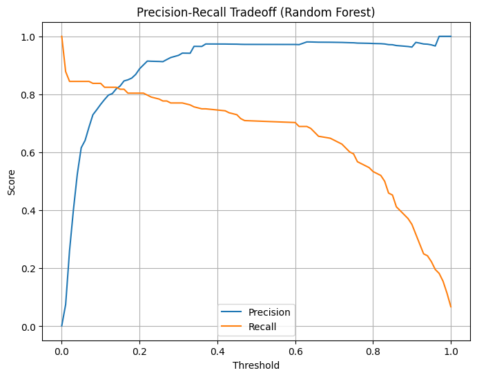
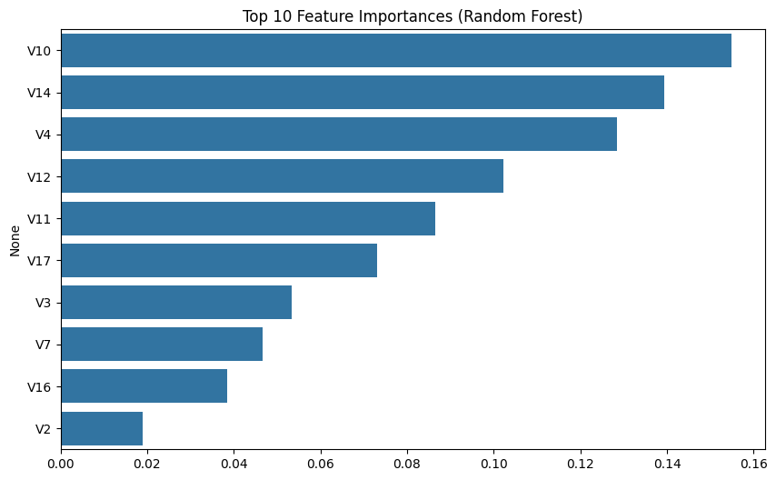

# 🕵️ Credit Card Fraud Detection - Machine Learning Project

Detecting fraudulent transactions using supervised machine learning.  
Built with Python, scikit-learn, and a Kaggle dataset — designed for performance, interpretability, and real-world relevance.


## 🚀 Project Overview

This project tackles the highly imbalanced credit card fraud detection problem using:
- Logistic Regression (baseline)
- Random Forest (tuned with class balancing)
- Precision/Recall curve optimization
- Feature importance analysis

**Goal:** Catch as many frauds as possible while minimizing false alarms.


## 📊 Dataset

- [Kaggle: Credit Card Fraud Detection](https://www.kaggle.com/datasets/mlg-ulb/creditcardfraud)
- 284,807 transactions
- 492 frauds (~0.172%)
- Features are anonymized (PCA-transformed)


## 🧠 Key Steps

1. **EDA** – Class imbalance, amount/time trends, feature correlation
2. **Preprocessing** – Feature scaling, train/test split with stratification
3. **Modeling** – Logistic regression + Random forest with class weighting
4. **Evaluation** – Confusion matrix, ROC AUC, precision/recall tradeoffs
5. **Feature Importance** – Identifying most predictive PCA components

## 📈 Results

- Random Forest:
  - Precision: 97.2%
  - Recall: 70.3%
  - ROC AUC: 93.76%

- Very few false alarms and strong fraud recall

**Precision-Recall Tradeoff**:  
  The model maintains **>95% precision while achieving 70–80% recall** across a range of thresholds — ideal for minimizing false positives while catching the majority of fraud.

## 📸 Visuals

<p float="left">
  
  
</p>

---

## 🛠️ Tech Stack

- Python, scikit-learn, pandas, matplotlib, seaborn
- Jupyter Notebook
- Random Forest, Logistic Regression
- Kaggle API (optional)

---

## 📂 How to Run

```bash
# Create virtual environment
python -m venv .venv
source .venv/bin/activate  # or .venv\Scripts\activate on Windows

# Install dependencies
pip install -r requirements.txt

# Open the notebook
jupyter notebook notebooks/01_fraud_detection.ipynb
